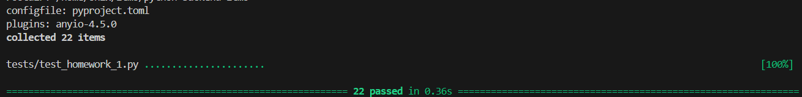

# Python Backend Course 

### Prerequirements

You need installed:
- ubuntu
- - tested on Windows WSL2
- python 3.12
- - (as main interpreter added to PATH)
- poetry
- makefile

### Clone the repo

```
cd your_workfolder

git clone https://github.com/3ndetz/python-backend-itmo
```

#### Prepare to run

Enter the folder and check installations

```
cd python-backend-itmo

make installpoetry
```

### Run apps

For homework 1:

run uvicorn app server with command:

`make run hw1`

For homework N:
`make run hwN`

To test homework 1 open another terminal & run testing script

`cd python-backend-itmo`

`make test_hw1`

# Screenshots

If scripts somehow is not working.

## HW 1



---

# Additional / original info

#### Лекция 1 - Основы сети и Python Backend

Реализовать "Математическое API" из примера напрямую через ASGI-compatible
функцию. В частности

- запросы, для которых нет обработчиков (не тот метод, не тот путь) должны
  возвращать ошибку `404 Not Found`
- запрос `GET /factorial` (n!)
  - возвращается в тело запроса в формате json вида `{"result": 123}`
  - в query-параметре запроса должен быть параметр `n: int`
  - если параметра нет, или он не является числом - возвращаем `422
    Unprocessable Entity`
  - если параметр не валидное число (меньше 0) - возвращаем `400 Bad Request`
- запрос `GET /fibonacci` (n-ое число fibonacci)
  - возвращается в тело запроса в формате json вида `{"result": 123}`
  - в path-параметре запроса (`fibonacci/{n}`) должен быть параметр `n: int`
  - если параметра нет, или он не является числом - возвращаем `422
    Unprocessable Entity`
  - если параметр не валидное число (меньше 0) - возвращаем `400 Bad Request`
- запрос `GET /mean` (среднее массива)
  - возвращается в тело запроса в формате json вида `{"result": 123}`
  - в теле запроса не пустой массив из `float`'ов (например `[1, 2.3, 3.6]`)
  - тело не является массивом `float`'ов - возвращаем `422
    Unprocessable Entity`
  - если массив пустой - возвращаем `400 Bad Request`

Болванка для начала:

```python
async def app(scope, receive, send) -> None:
    ...
```

В репозитории так же должна быть организована работа с зависимостями (хотя бы
`requirements.txt`).

Стоит так же заранее прописать (в коде или `README.md`), как запустить
приложение (например: `uvicorn main:app`).

- [Спецификация ASGI](https://asgi.readthedocs.io/en/latest/specs/www.html#http)
- [Исходный код API на FastAPI](/lecture_1/math_example.py)
- [Тесты для первого ДЗ (pytest)](/tests/test_homework_1.py)

Чтобы протестировать свое ДЗ или работу примера на FastAPI - в одном терминале
запустите приложение (например `uvicorn lecture_1.math_example:app`), а в другом
выполните `pytest`.
